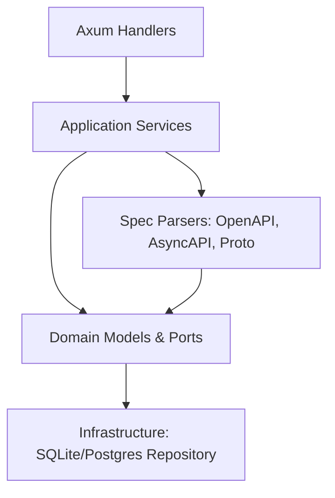

# Requirements

### Overview & Goals
The goal is to extend Sanshain Service to support AsyncAPI (for Kafka) and Proto (for gRPC) in addition to the existing OpenAPI support. This allows for a unified view of all API dependencies across different protocols.

### Scope
#### In Scope
- Storing and tracking AsyncAPI channels and operations.
- Storing and tracking gRPC services and methods from `.proto` files.
- New endpoints for providing and requiring these API types.
- Updating the dependency graph and reports to distinguish between API types.

#### Out of Scope
- Full validation of AsyncAPI or Proto specifications (basic structural parsing for splitting only).
- Support for other protocols like GraphQL or SOAP (can be added later using the same pattern).

# Technical Design

### Current Implementation
The current system is heavily oriented towards OpenAPI. Endpoints are identified by `path` and `method` (HTTP), and the database schema reflects this.

### Key Decisions
- **Splitting Strategy**: AsyncAPI will be split by channel (topic) and operation (publish/subscribe). Proto will be split by service and method. This maintains consistency with the OpenAPI splitting logic and allows fine-grained dependency tracking.
- **Database Schema**: Add an `api_type` column to `endpoints` and `dependencies` tables. This avoids creating new tables for each protocol and leverages existing logic for branches and services.
- **Protocol Mapping**:
  - **OpenAPI**: path = URL path, method = HTTP method (GET, POST, etc.)
  - **AsyncAPI**: path = Channel Name, method = Operation (PUB, SUB)
  - **Proto**: path = Service Name, method = Method Name

### Proposed Changes

#### Domain Models (`src/domain/models.rs`)
- Introduce `ApiType` enum.
- Add `api_type` field to all endpoint and dependency related structs.

#### Domain Ports (`src/domain/ports.rs`)
- Update `SpecRepository` trait to include `api_type` in relevant method signatures.

#### Specification Parsers
- **`src/asyncapi.rs`**: New module to parse AsyncAPI YAML and split it into per-channel snippets.
- **`src/proto.rs`**: New module to parse `.proto` files and extract service/method definitions.

#### Application Services (`src/application/services.rs`)
- Generalize `provide_spec_inner` to accept `ApiType` and dispatch to the correct parser.
- Update dependency recording and reporting to be protocol-aware.

#### Presentation Layer (`src/lib.rs`)
- Add new handlers for AsyncAPI and Proto.
- Add new routes:
  - `POST /provide/asyncapi`
  - `POST /provide/grpc`
  - `GET /require/asyncapi`
  - `GET /require/grpc`

### Architecture Diagram

# Testing

### Validation Approach
- **Unit Tests**: Add tests for AsyncAPI and Proto parsers to ensure they correctly identify channels/methods.
- **Integration Tests**: Verify the full flow of providing an AsyncAPI/Proto spec and requiring parts of it.
- **UI Verification**: Ensure the API type is correctly displayed in the dashboard and reports.

### Key Scenarios
1. **Provide AsyncAPI**: A service provides an AsyncAPI spec with multiple channels. Verify that each channel/operation pair is stored as an individual endpoint with `api_type = AsyncApi`.
2. **Require AsyncAPI**: A client requires a specific Kafka topic. Verify that a dependency is recorded with the correct API type.
3. **Provide Proto**: A service provides a `.proto` file. Verify that each service/method is extracted.
4. **Dependency Report**: Generate a report for a branch containing mixed API types and verify the Mermaid diagram shows the protocols.

# Delivery Steps

### ✓ Step 1: Domain and Infrastructure Updates
Update domain models and database schema to support multiple API types.
- Add `ApiType` enum and update model structs in `src/domain/models.rs`.
- Update `SpecRepository` port in `src/domain/ports.rs`.
- Add database migrations for SQLite and Postgres.
- Update `SqliteSpecRepository` and `PostgresSpecRepository` implementations.

### ✓ Step 2: Specification Parsers for AsyncAPI and Proto
Implement parsing logic to split AsyncAPI and Proto files into individual endpoints.
- Create `src/asyncapi.rs` to split AsyncAPI YAML by channel/operation.
- Create `src/proto.rs` to split `.proto` files by service/method.
- Integrate these parsers into the application layer.

### ✓ Step 3: Application Services and API Endpoints
Update application logic and add new API endpoints for AsyncAPI and Proto.
- Generalize `provide_spec_inner` and `require_endpoint_inner` in `src/application/services.rs`.
- Implement new provide/require handlers in `src/lib.rs`.
- Register new routes: `/provide/asyncapi`, `/provide/grpc`, `/require/asyncapi`, `/require/grpc`.

### ✓ Step 4: UI and Report Integration
Update the web interface and dependency reports to display the API type.
- Update `render_report_markdown` and `render_isolation_report` to show API types in diagrams and lists.
- Update HTML fragments in `src/lib.rs` and templates to display the `api_type` for endpoints.