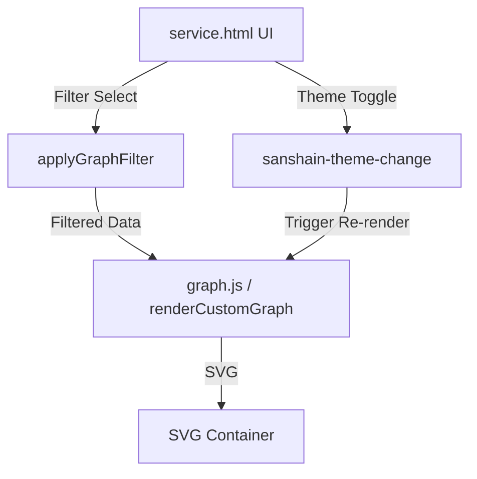

# Requirements

### Overview & Goals
Enhance the dependency graph in the Admin UI with advanced filtering capabilities, improved layout for large screens, and better accessibility of controls and legends. The graph should also adapt its colors to the system's dark/light mode for optimal visibility.

### Scope
- **Circular Dependencies**: Add a dedicated view to isolate and inspect services caught in cycles.
- **Focus Mode**: Allow users to focus on specific services and their immediate connections.
- **UI/UX Refinement**: Move controls and legends to more accessible locations and allow the graph to use the full screen width.
- **Dark Mode Support**: Ensure the graph is well-rendered in both light and dark themes.

### User Stories
- **As an Architect**, I want to see only circular dependencies so I can identify and fix architectural smells in the service graph.
- **As a Developer**, I want to focus on my service and its peers so I can understand its direct dependencies without being overwhelmed by the full graph.
- **As an Admin**, I want the graph to use my large monitor's full width and look good in dark mode so I can monitor the system comfortably.


# Technical Design

### Current Implementation
- The graph is rendered using a custom `dagre`-based SVG renderer in `static/js/graph.js`.
- Controls (direction, download) are located in the section header.
- The legend is at the bottom, often requiring scrolling to see.
- Colors are hardcoded for light mode.
- Layout is constrained by a standard Tailwind container.

### Proposed Changes

#### 1. Graph Filtering Logic
- **Circular Only**: Filter the graph data to include only nodes and edges that are part of a detected cycle.
- **Service Focus**: Filter the graph to show a subset of nodes (specified by user) and their direct neighbors (in/out edges).
- **Implementation**: Filtering will happen in the frontend by transforming the `lastGraphReport` before passing it to the renderer.

#### 2. UI/UX Enhancements
- **Full Width Mode**: When the graph tab is active, the main container will expand from its fixed-width `container` class to `max-w-none` to use the entire screen width.
- **Floating Toolbar**: Move Pivot (Vertical/Horizontal), Copy, and Download buttons to a floating toolbar on the top-right of the graph area.
- **Top-Side Legend**: Move the color legend to the top of the graph area for better visibility.
- **Filter Bar**: Add a bar containing "All", "Circular Only", and a "Focus" search field.

#### 3. Dark Mode Integration
- **Event-Driven**: `common.js` will dispatch a `sanshain-theme-change` event when the theme is toggled.
- **Theme-Aware Colors**: `graph.js` will select colors based on the current `html.dark` class presence.
- **SVG Styling**: Update node fills, strokes, and text colors for dark mode (using deeper shades for backgrounds and lighter shades for text/borders).

#### 4. Mermaid Support
- Apply the same filtering logic to the Mermaid renderer to ensure consistency when switching modes.

### Data Models / Contracts
The `DependencyReport` structure remains unchanged, but a new `GraphFilter` state will be managed in `service.html`:
```javascript
{
    type: 'all' | 'circular' | 'focus',
    services: string[] // for 'focus' type
}
```

### Architecture Diagram



# Testing

### Validation Approach
- **Manual Verification**:
    - Verify "Circular Only" button is enabled only when cycles exist (can be tested using `demo2.sh`).
    - Test "Focus" with single and multiple service names.
    - Switch between light and dark mode and verify graph colors change accordingly.
    - Check layout on different screen sizes to ensure full-width expansion works.
- **Edge Cases**:
    - Focus on a service that doesn't exist (should show empty graph or just the node).
    - Very large graphs (ensure pan/zoom still works with the new layout).
    - Rapidly toggling filters while a large graph is rendering.


# Delivery Steps

###   Step 1: Implement Theme-Aware Rendering and Graph Utilities
Enhance `common.js` and `graph.js` to support theme-aware rendering and expose utilities for filtering.

- Update `sanshainToggleTheme` in `static/js/common.js` to dispatch a `sanshain-theme-change` event.
- In `static/js/graph.js`, implement a color helper that picks appropriate shades for nodes and edges based on the current theme (light/dark).
- Update `renderCustomGraph` to use these theme-aware colors.
- Ensure `graphDetectCycles` is exported and robust for use in the main page.
- Add support for a `filterOptions` parameter in `renderCustomGraph` to handle subgraph rendering.

###   Step 2: Revamp Graph Section UI and Layout in service.html
Reorganize the graph section in `static/service.html` to improve the layout and add new controls.

- Modify the graph header to include a new "Filters" group with "All", "Circular Only", and "Focus" (input + button).
- Move the Legend from the bottom to the top of the graph area, just below the header.
- Create a floating toolbar on the right side of the graph container for "Pivot", "Copy", and "Download" buttons.
- Wrap the graph SVG in a more flexible container that can expand to fill the available space.
- Implement CSS overrides to allow the main container to expand to full width when the graph is active.

###   Step 3: Implement Graph Filtering and Focus Logic
Implement the logic for circular dependency detection and service focus filtering.

- Add a `currentGraphFilter` state to `static/service.html`.
- Implement `applyGraphFilter` helper to transform the `DependencyReport` data based on the selected filter.
- Wire up the "Circular Only" button: it should only be enabled if cycles are detected in the full graph.
- Implement the "Focus" logic: filter the graph to show only the specified services and their immediate peers (neighbors).
- Ensure that switching between filters or graph modes (Custom/Mermaid) correctly reapplies the current filter without unnecessary network requests.

###   Step 4: Integrate Theme Switching and Final UI Polish
Connect dark mode switching to the graph renderer and perform final UX polish.

- In `static/service.html`, add an event listener for `sanshain-theme-change` to trigger a re-render of the graph.
- Update `showGraph`, `showServices`, etc., to toggle the full-width layout mode.
- Ensure the "Pivot" (Vertical/Horizontal) toggle works correctly with the new layout.
- Verify that the graph fills the screen on large monitors and that the legend is clearly visible at the top.