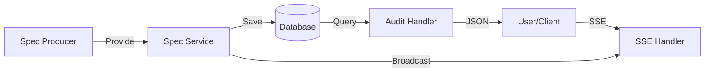

# Requirements

### Overview & Goals
Enhance the Sanshain Service with advanced features for enterprise usage, including auditability, better interactivity, and stricter contract enforcement.

### User Stories
- **As an Admin**, I want to see a history of all changes to a branch so I can audit who changed what and when.
- **As a Developer**, I want to see details about a service or connection in the graph by hovering over it, so I can quickly navigate to relevant specs.
- **As a Consumer**, I want to be warned if I am using a deprecated endpoint so I can plan a migration.
- **As a Producer**, I want to be blocked from accidentally removing an endpoint on a protected branch.

### Functional Requirements
- **Audit View**: A new page showing a timeline of spec updates, including diffs and author metadata.
- **Graph Popups**: Interactive tooltips on nodes and edges with links to service/client/endpoint details.
- **Breaking Change Detection**: 
    - Detect removed paths/operations as breaking changes.
    - Stricter check for new required fields in request schemas.
- **Deprecation**:
    - Automatically detect `deprecated: true` from OpenAPI specs.
    - Warn clients via HTTP headers and UI indicators.
- **PNG Export**: Allow downloading the graph as a PNG image.
- **Live Updates**: Use SSE to refresh the UI when specs are updated.
- **SemVer Support**: Move from monotonic integers to Semantic Versioning.

### Scope
- **In Scope**: All features mentioned above.
- **Out of Scope**: Real-time collaboration (WebSockets) - deferred to a later phase.

# Technical Design

### Current Implementation
- Breaking changes only check existing paths for operation compatibility.
- History is stored in `endpoint_versions` but not easily accessible in a summarized view.
- Graph tooltips use basic SVG `<title>` elements.

### Key Decisions
- **Audit Data Source**: Leverage existing `endpoint_versions` and `endpoint_version_metadata` tables.
- **SSE Pattern**: Use Axum's SSE support with the existing `spec_updated_tx` broadcast channel.
- **Graph Interactivity**: Move from SVG `<title>` to a custom HTML overlay for popups to allow links and rich formatting.

### Proposed Changes

#### Backend
- **New Endpoints**:
    - `GET /api/audit/history?branch=...`: Returns a list of changes for a branch.
    - `GET /api/sse/updates`: SSE stream for update notifications.
- **Models**:
    - Add `deprecated: bool` to `EndpointRecord`.
- **Database**:
    - Migration to add `deprecated` column to `endpoints` table.
- **Logic**:
    - Update `src/openapi.rs` to detect removed paths in `check_openapi_compatible`.
    - Update `src/application/spec_service.rs` to handle deprecation flags.

#### Frontend
- **Audit Page**: `audit.html` with a timeline component.
- **Graph Tooltips**: Use a `div` with `absolute` positioning, updated on `mouseover` in `graph.js`.
- **UI Notifications**: Connect to SSE and show a toast/refresh when notified.

### Architecture Diagram

### Risks
- **SSE Scalability**: Many open connections might consume server resources (mitigated by using lightweight broadcast channels).
- **PNG Export Quality**: Complex graphs might be hard to render to PNG at high resolution in-browser.

# Testing

### Validation Approach
- **Manual Verification**: Verify the Audit view displays recent changes correctly. Check graph popups for links.
- **Automated Tests**:
    - Unit tests for breaking change detection (path removal).
    - Unit tests for OpenAPI deprecation parsing.
    - Integration tests for the new Audit API.

### Key Scenarios
- **Scenario 1: Endpoint Removal**: Upload a spec with a missing path to a protected branch -> should fail.
- **Scenario 2: Deprecation Warning**: Mark an endpoint as deprecated in OpenAPI -> client `/require` should see a warning in headers.
- **Scenario 3: Audit Trail**: Update a spec -> Audit view should show a new entry with the correct author and diff.

# Delivery Steps

### ✓ Step 1: Implement PNG Export for Dependency Graph
Dependency graph can be exported as PNG in addition to SVG.

- Implement `exportToPng` in `static/js/graph.js` using a `<canvas>` or a library like `canvg`.
- Add a "Download PNG" button to the graph UI.
- Ensure the PNG has high resolution (multi-factor scale).

### ✓ Step 2: Add Server-Sent Events (SSE) for Live UI Updates
Web UI receives real-time updates when specs change.

- Create `GET /api/sse/updates` endpoint in `src/presentation/handlers/api.rs`.
- Use `state.spec_updated_tx` to broadcast events to connected SSE clients.
- Update `static/js/common.js` or `discovery.js` to listen to SSE and trigger UI refresh or show notification.

### * Step 3: Implement Deprecation Support and Client Warnings
Endpoints can be marked as deprecated in OpenAPI, and clients are warned.

- Add `deprecated` column to `endpoints` table via migration.
- Update `EndpointRecord` and `EndpointInfo` models.
- Update OpenAPI parser to extract `deprecated: true` from specs.
- Inject `X-Sanshain-Deprecated` header in `/require` response if the endpoint is deprecated.
- Update Graph UI to show a warning icon/color for deprecated nodes/edges in popups.

###   Step 4: Enhance Breaking Change Detection Logic
Endpoint removal and breaking schema changes are correctly identified.

- Update `openapi::check_openapi_compatible` in `src/openapi.rs` to detect removed paths and methods.
- **New Rule**: Only endpoints previously marked as `deprecated: true` are allowed to be removed on protected branches.
- Refine schema compatibility check to flag new required fields as breaking if they appear in Request Bodies.
- Ensure `provide_spec` rejects updates on protected branches if these breaking changes are detected.

###   Step 5: Implement Audit View with Change History
A new Audit view shows the history of changes per branch.

- Implement `GET /api/audit/history?branch=...` in `src/presentation/handlers/api.rs`.
- Fetch `endpoint_versions` joined with `endpoint_version_metadata` and `endpoints`.
- Create `static/audit.html` to display the history timeline.
- Add "Audit" link to the site header in all HTML files.
- Show diffs between versions in the Audit view.

###   Step 6: Implement Semantic Versioning (SemVer) for Specs
Support for MAJOR/MINOR/PATCH versioning of specifications.

- Update `service_spec_versions` table or logic to support SemVer strings.
- Add logic to automatically increment MAJOR/MINOR/PATCH based on breaking/non-breaking changes if not provided.
- Update UI to display SemVer instead of just integers.
