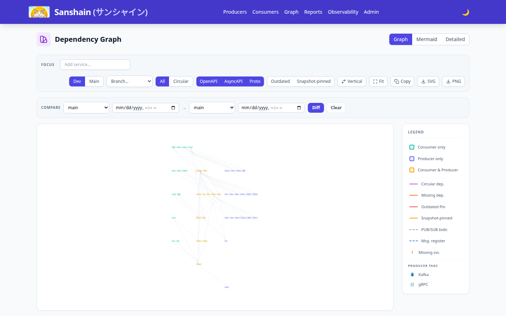

  

# [Sanshain Service](https://github.com/paxel/sanshain-service)

Sanshain (Japanese for "Sunshine") is a central repository to manage, split, and distribute API specifications. Microservices **provide** their full API definitions; clients **require** only the specific snippets (endpoints, channels, or methods) they actually use at build time.

### TL;DR
- **Centralized Specs**: Unified registry for OpenAPI, AsyncAPI, and gRPC/Proto.
- **Spec Splitting**: Clients download only the YAML snippets they need, avoiding massive dependency bloat.
- **Contract Safety**: Automatically detects breaking changes on protected branches.
- **Live Graph**: Visualizes microservice dependencies in real-time.
- **Client-First**: Designed for CI/CD automation with dedicated plugins.

---

## Core Features
- **Multi-Protocol**: Native support for OpenAPI, AsyncAPI, and Protocol Buffers.
- **Backward Compatibility**: Rejects breaking changes on protected branches (e.g., `main`) for all three protocols; elements marked deprecated may be removed. See [API Lifecycle](docs/api-lifecycle.md).
- **Dependency Tracking**: Tracks exactly which client version uses which endpoint.
- **Web Dashboard**: Navigate services, branches, and dependencies visually.
- **Auditing**: Full history of spec changes with unified diffs.

## Quick Start
1. **Launch**: `docker run -p 3000:3000 -v sanshain-data:/data ghcr.io/paxel/sanshain-service:latest`
2. **Setup**: Access `http://localhost:3000/admin.html` with the random password printed in the logs.
3. **Demo**: Run `./demo.sh` to populate the service with sample data.

Detailed instructions: [**Getting Started**](docs/getting-started.md).

## Documentation
- [**User Guide**](docs/user-guide.md) — Day-to-day usage: providing and requiring APIs.
- [**Client Ecosystem**](docs/clients.md) — Detailed guide for Maven, Cargo, Go, JS, and Conan.
- [**API Lifecycle**](docs/api-lifecycle.md) — How to handle breaking changes and versioning.
- [**API Usage**](docs/api-usage.md) — Authentication and detailed endpoint reference.
- [**Administration**](docs/administration.md) — LDAP setup, protected branches, and user management.
- [**Troubleshooting**](docs/troubleshooting.md) — Common issues and how to solve them.
- [**AI Migration**](docs/ai-migration.md) — Guide for using AI to migrate your services to Sanshain.
- [**Corporate Best Practices**](docs/corporate-best-practices.md) — Recommendations for enterprise usage.

## Clients & Plugins
Integrate Sanshain directly into your build process:
- [**Maven Plugin**](https://github.com/paxel/sanshain-maven-plugin) — Java/Kotlin integration.
- [**Rust (Cargo)**](https://github.com/paxel/sanshain) — Subcommand for Rust microservices.
- [**Go CLI**](https://github.com/paxel/sanshain-go) — CLI and client for Go projects.
- [**JavaScript/TypeScript**](https://github.com/paxel/sanshain-js) — Node.js client, CLI, and GitHub Action.
- [**Conan Plugin**](https://github.com/paxel/sanshain-conan) — C/C++ dependency management for APIs.

## License
Apache-2.0 License. See [LICENSE](LICENSE).

## Changelog
See [CHANGELOG.md](CHANGELOG.md) for the latest updates.
