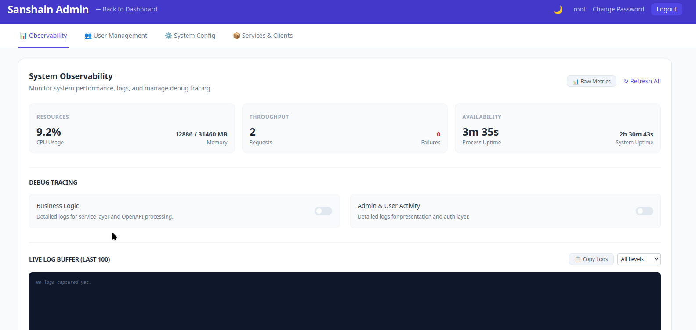
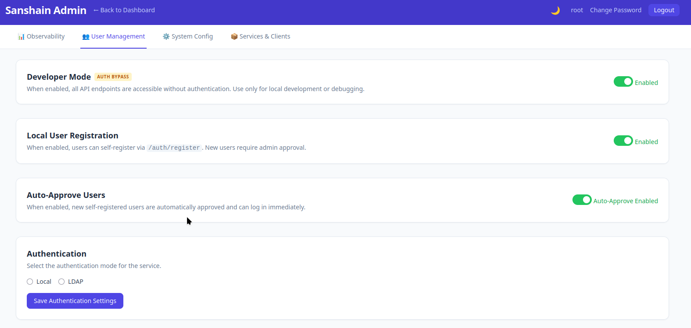
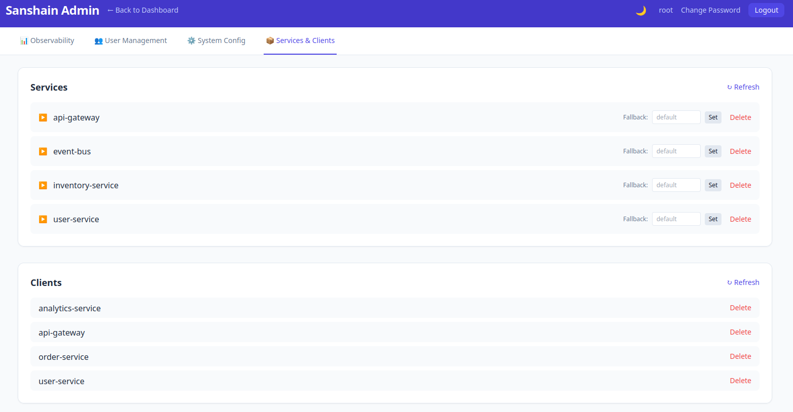

# Administration

This guide covers the admin dashboard at `/admin.html` and the day-to-day tasks an administrator performs.

## Accessing the Dashboard

Open `/admin.html` in your browser and sign in with an admin account. On a fresh installation the only admin account is **root** — see [Getting Started](getting-started.md) for the initial password procedure.



After a successful login the dashboard loads with all management sections organized into tabs: **Observability**, **User Management**, **System Config**, and **Services & Clients**.



## Observability

The **Observability** tab provides real-time insights into the system's health:

- **System Stats**: Live view of CPU usage, memory consumption, and uptime.
- **Request Counters**: Total requests and 5xx failure counters for business logic.
- **Log Viewer**: An in-memory ring buffer showing the last 100 log messages with level filtering.
- **Debug Tracing**: Toggleable flags to enable detailed tracing for business logic or admin activity at runtime.

## Developer Mode

Developer Mode is configured via the unified **Authentication** section of the admin dashboard. Selecting **Dev Mode** allows public API endpoints (`/provide`, `/require`, `/report`) to be accessible without any authentication. This is useful for local development and quick testing, but should not be used in production.

## Protected Branches

Protected branches enforce **immutable endpoint paths**. Once an endpoint is published on a protected branch, its schema cannot change; consumers can rely on it being stable. To evolve an endpoint you must bump the version in the path (e.g. `/api/v1/users` → `/api/v2/users`).

By default `main` and `master` are protected. You can add or remove patterns:

- Type a pattern into the text field (e.g. `release/*`) and press **Add**.
- Click the **×** button next to an existing pattern to remove it.

On non-protected (feature) branches, endpoint definitions can be freely overwritten.

## Local User Management

Sanshain supports local user accounts with the following settings in the **User Management** tab:

### Local User Registration

When **Local User Registration** is enabled, anyone can create an account via the web UI at `/account.html` or by calling `POST /auth/register`.

- **Off (default)** — only the admin can create users.
- **On** — self-registration is open.

### Auto-Approve Users

- **Off (default)** — new accounts are created in a **pending** state and must be approved by an admin before the user can log in.
- **On** — new accounts are automatically approved and can log in immediately.

This is intended for development and internal use. For production environments, consider using LDAP authentication (see below).

## Authentication Mode (OFF / Maintenance, Dev, Local, LDAP)

The **Authentication** section on the admin dashboard lets you choose how users authenticate:

| Mode | Description |
|------|-------------|
| **OFF / Maintenance** | Default on new installations. Restricts all anonymous and token-based interaction with provide/require API endpoints, returning 503 Service Unavailable. |
| **Dev Mode** | No authentication required for public API endpoints. |
| **Local Users** | Built-in user management with Argon2 password hashing. |
| **LDAP** | Delegate authentication to an external LDAP / Active Directory server. |

### Configuring LDAP

1. Select the **LDAP** radio button in the Authentication section.
2. Fill in the LDAP configuration form:

| Field | Description | Example |
|-------|-------------|---------|
| **Server URL** | LDAP server address. Use `ldaps://` for TLS. | `ldap://ldap.example.com:389` |
| **Bind DN** | Service account DN used to search for users. | `cn=readonly,dc=example,dc=com` |
| **Bind Password** | Password for the service account. | *(stored encrypted, shown as `****`)* |
| **Base DN** | Search base for user lookups. | `dc=example,dc=com` |
| **User Filter** | LDAP filter to find users. `{username}` is replaced with the login name. | `(uid={username})` |
| **Admin Group DN** | Users who are members of this group get admin privileges. Leave empty to disable. | `cn=admins,ou=groups,dc=example,dc=com` |

3. Click **Test Connection** to verify that Sanshain can reach the LDAP server and bind with the service account.
4. Click **Save Authentication Settings** to apply.

### How LDAP Login Works

When LDAP mode is active:

1. Sanshain binds to the LDAP server with the configured service account.
2. It searches for the user using the **User Filter** under the **Base DN**.
3. If found, it attempts a bind as the user with the provided password.
4. On success, a **shadow account** is auto-provisioned in the local database (if it doesn't already exist). This allows sessions and API tokens to work exactly as with local users.
5. If an **Admin Group DN** is configured, the user's `memberOf` attribute is checked to determine admin status.

### API Endpoints

The auth configuration can also be managed via the REST API:

- `GET /admin/auth-config` — Returns the current auth mode and LDAP configuration (password redacted).
- `PUT /admin/auth-config` — Set the auth mode and (optionally) LDAP configuration:
  ```json
  {
    "auth_mode": "ldap",
    "ldap_config": {
      "server_url": "ldap://ldap.example.com:389",
      "bind_dn": "cn=admin,dc=example,dc=com",
      "bind_password": "secret",
      "base_dn": "dc=example,dc=com",
      "user_filter": "(uid={username})",
      "admin_group": "cn=admins,ou=groups,dc=example,dc=com"
    }
  }
  ```
- `POST /admin/auth-config/test` — Test LDAP connectivity with the provided configuration.

> **Note:** Submitting `"bind_password": "****"` in a PUT or test request preserves the previously stored password.

## User Management

The **Users** section lists every registered user with their status:

| Badge        | Meaning                                            |
|--------------|----------------------------------------------------|
| **admin**    | The user has administrator privileges.             |
| **approved** | The user can log in and use the service.           |
| **pending**  | The user registered but has not yet been approved. |

Available actions:

- **Approve** — grant a pending user access to the service.
- **Delete** — permanently remove a user and revoke all their sessions and API tokens.

## Service Management

The **Services** section lists all services that have provided at least one OpenAPI specification. Each entry shows the service name.

- **Delete** — removes the service and **cascades** to all its branches, endpoints, and related client dependencies. A confirmation dialog appears before deletion.

For a detailed view of a service's branches and endpoints, use the [Service Overview](/service.html) page instead.

## Client Management

The **Clients** section lists all clients that have registered at least one dependency via `/require`.

- **Delete** — removes the client and all its recorded dependencies. A confirmation dialog appears before deletion.

## Changing Your Password

Click the **Change Password** button in the top navigation bar to open the password dialog.

Enter your current password and a new password, then click **Update Password**. The change takes effect immediately; existing sessions remain valid.

## Database Configuration

Sanshain supports two database backends: **SQLite** (default) and **PostgreSQL**. The backend is selected automatically based on the `DATABASE_URL` environment variable:

| URL prefix | Backend |
|---|---|
| `sqlite:` or not set | SQLite |
| `postgres://` or `postgresql://` | PostgreSQL |

The current database backend and a masked connection URL are visible in the admin dashboard under **Database Configuration**. This section is read-only — to switch backends, change the `DATABASE_URL` environment variable and restart the service.

For detailed setup instructions, see [Getting Started — PostgreSQL](getting-started.md#installation-with-docker-postgresql).

## Related Pages

- **Account** (`/account.html`) — manage your own password and API tokens.

  
