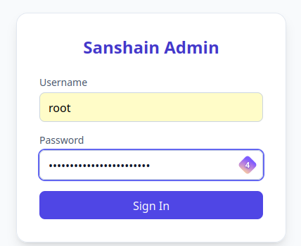
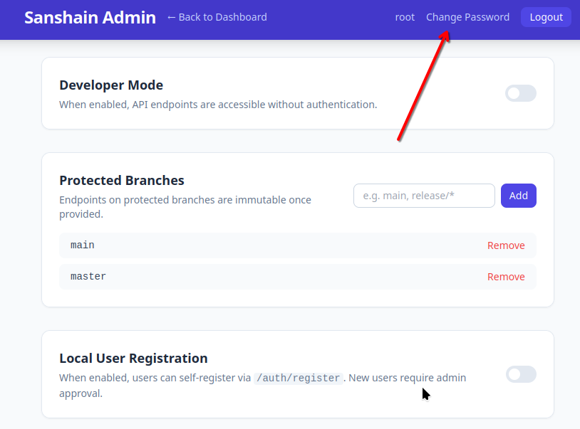
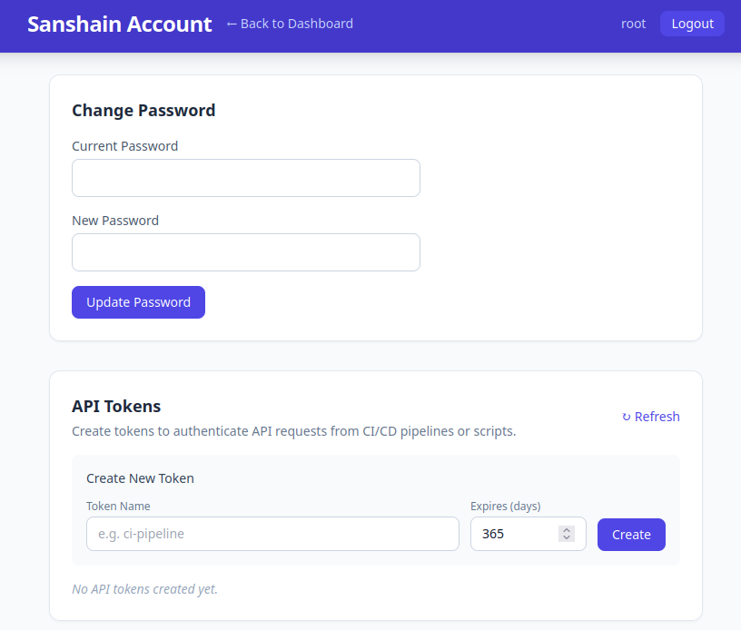

# Administration

This guide covers the admin dashboard at `/admin.html` and the day-to-day tasks an administrator performs.

## Accessing the Dashboard

Open `/admin.html` in your browser and sign in with an admin account. On a fresh installation the only admin account is **root** — see [Getting Started](getting-started.md) for the initial password procedure.

After a successful login the dashboard loads with all management sections visible.

## Developer Mode

The **Developer Mode** toggle controls whether the public API endpoints (`/provide`, `/require`, `/report`) are accessible without authentication.

- **Off (default)** — every request must carry a valid session cookie or `Authorization: Bearer` token.
- **On** — all non-admin endpoints are open to anonymous callers. Useful for local development and quick testing.

Toggle the switch and the change takes effect immediately — no restart required.

## Protected Branches

Protected branches enforce **immutable endpoint paths**. Once an endpoint is published on a protected branch, its schema cannot change; consumers can rely on it being stable. To evolve an endpoint you must bump the version in the path (e.g. `/api/v1/users` → `/api/v2/users`).

By default `main` and `master` are protected. You can add or remove patterns:

- Type a pattern into the text field (e.g. `release/*`) and press **Add**.
- Click the **×** button next to an existing pattern to remove it.

On non-protected (feature) branches, endpoint definitions can be freely overwritten.

## Local User Registration

When **Local User Registration** is enabled, anyone can create an account via the web UI at `/account.html` or by calling `POST /auth/register`.

- **Off (default)** — only the admin can create users.
- **On** — self-registration is open, but new accounts are created in a **pending** state and must be approved by an admin before the user can log in.

This is intended for development and internal use. In production environments, consider delegating authentication to an external provider (LDAP, Keycloak, etc.).

## User Management

The **Users** section lists every registered user with their status:

| Badge        | Meaning                                            |
|--------------|----------------------------------------------------|
| **admin**    | The user has administrator privileges.             |
| **approved** | The user can log in and use the service.           |
| **pending**  | The user registered but has not yet been approved. |

Available actions:

- **Approve** — grant a pending user access to the service.
- **Delete** — permanently remove a user and revoke all their sessions and API tokens.

## Service Management

The **Services** section lists all services that have provided at least one OpenAPI specification. Each entry shows the service name.

- **Delete** — removes the service and **cascades** to all its branches, endpoints, and related client dependencies. A confirmation dialog appears before deletion.

For a detailed view of a service's branches and endpoints, use the [Service Overview](/service.html) page instead.

## Client Management

The **Clients** section lists all clients that have registered at least one dependency via `/require`.

- **Delete** — removes the client and all its recorded dependencies. A confirmation dialog appears before deletion.

## Changing Your Password

Click the **Change Password** button in the top navigation bar to open the password dialog.

Enter your current password and a new password, then click **Update Password**. The change takes effect immediately; existing sessions remain valid.

## Related Pages

- **Account** (`/account.html`) — manage your own password and API tokens.

  
