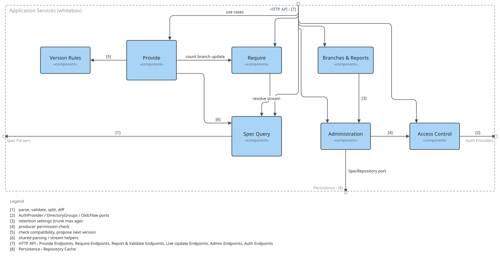

=== Whitebox Application Services

==== Motivation

Split by use case rather than by entity: the write path (Provide) and the read path (Require) were pulled out of spec_service so neither flow is interleaved with rules it does not need, and the version rules were isolated as pure functions so they can be decided without a database. Release graphs and reports, administration, and access control each form their own module. Every module except Version Rules is reached from the HTTP API. All of them except Version Rules also store through the SpecRepository port; to keep the diagram readable that line is drawn only from Administration.

==== Contained building blocks

[options="header"]
|===
|Name |Responsibility

|Access Control
|Authentication and authorization (auth_service.rs, authz.rs, directory_roles.rs): password hashing, login and tokens, resolving an Actor with roles, groups and maintainer scopes, and short-lived caching of directory-derived roles.

|Administration
|Operator use cases (admin_service.rs): delete producers, consumers and versions, retention settings and cleanup of snapshots, dependencies and trunk data, user approval, and destructive resets.

|Branches & Reports
|Release graphs (branch_service.rs, report_service.rs, ADR-0004/0005): create, rename and delete sanshain-branches from trunk or another branch at an instant, timelines and graph diffs, and dependency reports scoped to dev, main or a branch (JSON, Markdown, isolation).

|Provide
|Publish use case (provide_service.rs, ADR-0003): accept a spec for a Producer, enforce version and stability rules, store the version line with its endpoints, promote snapshots to GA and harvest AsyncAPI subscribes.

|Require
|Consume use case (require_service.rs, ADR-0003): resolve a Consumer's pin to an exact version, return just the requested endpoint or bundle, and record the dependency and trunk/branch pins it implies.

|Spec Query
|Read use cases (spec_service.rs): endpoint views, version listing, diffs, endpoint history and provide timeline, plus spec parsing and stream helpers shared with Provide and Require.

|Version Rules
|Pure functions (version_rules.rs) that decide whether a candidate version is honest for its version line and propose the correct next version; no I/O.
|===

==== External interfaces

[options="header"]
|===
|Partner outside |Handled by |Direction |Text

|HTTP API › Provide Endpoints, Require Endpoints, Report & Validate Endpoints, Live Update Endpoints, Admin Endpoints, Auth Endpoints
|Provide
|in
|use cases

|HTTP API › Provide Endpoints, Require Endpoints, Report & Validate Endpoints, Live Update Endpoints, Admin Endpoints, Auth Endpoints
|Require
|in
|use cases

|HTTP API › Provide Endpoints, Require Endpoints, Report & Validate Endpoints, Live Update Endpoints, Admin Endpoints, Auth Endpoints
|Spec Query
|in
|use cases

|HTTP API › Provide Endpoints, Require Endpoints, Report & Validate Endpoints, Live Update Endpoints, Admin Endpoints, Auth Endpoints
|Branches & Reports
|in
|use cases

|HTTP API › Provide Endpoints, Require Endpoints, Report & Validate Endpoints, Live Update Endpoints, Admin Endpoints, Auth Endpoints
|Administration
|in
|use cases

|HTTP API › Provide Endpoints, Require Endpoints, Report & Validate Endpoints, Live Update Endpoints, Admin Endpoints, Auth Endpoints
|Access Control
|in
|use cases

|Spec Parsers
|Spec Query
|out
|parse, validate, split, diff

|Persistence › Repository Cache
|Administration
|out
|SpecRepository port

|Auth Providers
|Access Control
|out
|AuthProvider / DirectoryGroups / OidcFlow ports
|===

==== Internal relations

[options="header"]
|===
|From |To |Direction |Text

|Spec Query
|Require
|in
|resolve stream

|Branches & Reports
|Administration
|out
|retention settings (trunk max age)

|Provide
|Require
|out
|count branch update

|Administration
|Access Control
|out
|producer permission check

|Provide
|Version Rules
|out
|check compatibility, propose next version

|Provide
|Spec Query
|out
|shared parsing / stream helpers
|===

