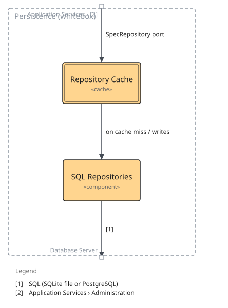

=== Whitebox Persistence

==== Motivation

The cache is a decorator over the same port the SQL repositories implement, so the use cases never know whether a read came from memory or the database; the backend is chosen at startup.

==== Contained building blocks

[options="header"]
|===
|Name |Responsibility

|Repository Cache
|Moka-based caching decorator around the SpecRepository port (src/infrastructure/cached_repository.rs); configurable and clearable from the admin settings.

|SQL Repositories
|sqlx implementations of SpecRepository for SQLite and PostgreSQL plus schema migrations (src/infrastructure/sqlite_repository.rs, postgres_repository.rs, database.rs, migrations).
|===

==== External interfaces

[options="header"]
|===
|Partner outside |Handled by |Direction |Text

|Database Server
|SQL Repositories
|out
|SQL (SQLite file or PostgreSQL)

|Application Services › Administration
|Repository Cache
|in
|SpecRepository port
|===

==== Internal relations

[options="header"]
|===
|From |To |Direction |Text

|Repository Cache
|SQL Repositories
|out
|on cache miss / writes
|===

