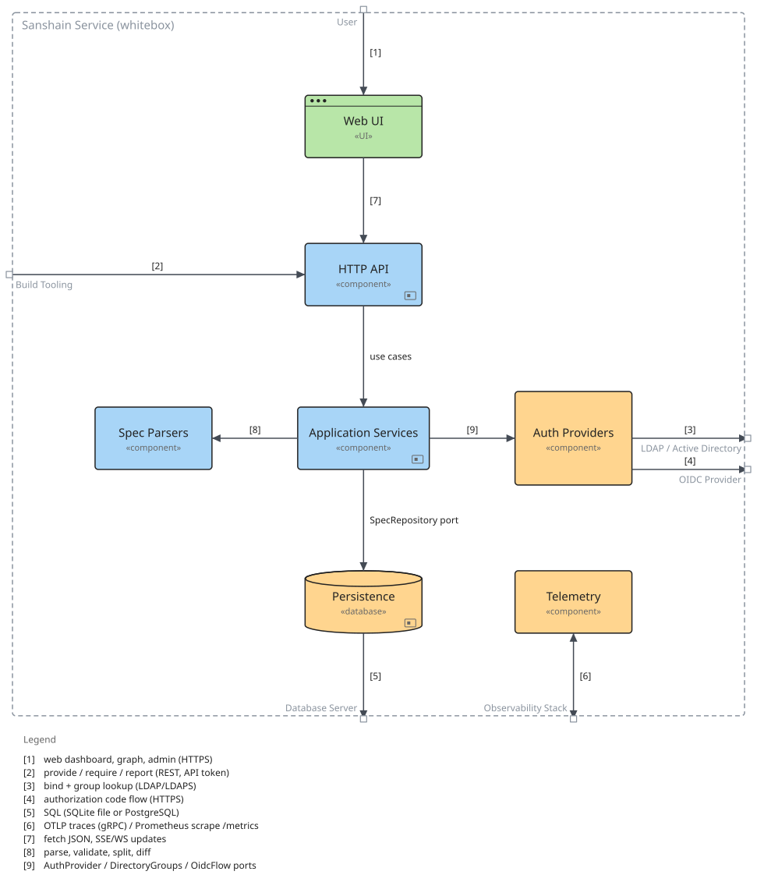

=== Whitebox Sanshain Service

==== Motivation

Hexagonal layering: the HTTP API translates REST requests into use cases; Application Services hold the business rules and depend on traits in the domain layer (models, permissions, ports - shared by every box, so not drawn). Infrastructure adapters implement those ports: Auth Providers for human login and Persistence for storage. Spec parsing is kept apart from the use cases so that the free validator and the publish path apply identical rules. Telemetry is fed by middleware layers on every request rather than by explicit calls.

==== Contained building blocks

[options="header"]
|===
|Name |Responsibility

|Application Services
|Use cases (src/application): provide and require specs, version-line rules, release branches and graph timelines, reports, administration, authentication and permission checks. Depends only on domain ports.

|Auth Providers
|Adapters for human login (src/infrastructure/*_provider.rs, tls.rs): local Argon2 accounts, LDAP/AD bind and group lookup, and the OIDC authorization code flow.

|HTTP API
|Axum router, handlers and middleware (src/presentation, src/lib.rs): REST endpoints for provide/require/report/admin/auth, token and session authentication, permission guards per route, SSE/WebSocket live updates and the /metrics endpoint.

|Persistence
|Implements the SpecRepository port: a Moka cache in front of interchangeable sqlx repositories for SQLite and PostgreSQL, including schema migrations.

|Spec Parsers
|OpenAPI, AsyncAPI and Protobuf handling (src/openapi.rs, src/asyncapi.rs, src/proto.rs): validate documents, extract version and endpoints, cut endpoint snippets and detect breaking changes.

|Telemetry
|OpenTelemetry tracer with OTLP exporter (src/infrastructure/telemetry.rs) and the Prometheus recorder behind /metrics; fed by the tracing and metric layers of every request.

|Web UI
|Browser dashboard (static/*.html, static/js, askama templates): producers, consumers, version timelines, diffs, dependency graph, reports, audit, observability and admin pages, plus the anonymous spec validator.
|===

==== External interfaces

[options="header"]
|===
|Partner outside |Handled by |Direction |Text

|User
|Web UI
|in
|web dashboard, graph, admin (HTTPS)

|Build Tooling
|HTTP API
|in
|provide / require / report (REST, API token)

|LDAP / Active Directory
|Auth Providers
|out
|bind {plus} group lookup (LDAP/LDAPS)

|OIDC Provider
|Auth Providers
|out
|authorization code flow (HTTPS)

|Database Server
|Persistence
|out
|SQL (SQLite file or PostgreSQL)

|Observability Stack
|Telemetry
|bi
|OTLP traces (gRPC) / Prometheus scrape /metrics
|===

==== Internal relations

[options="header"]
|===
|From |To |Direction |Text

|HTTP API
|Web UI
|in
|fetch JSON, SSE/WS updates

|HTTP API
|Application Services
|out
|use cases

|Application Services
|Spec Parsers
|out
|parse, validate, split, diff

|Application Services
|Persistence
|out
|SpecRepository port

|Application Services
|Auth Providers
|out
|AuthProvider / DirectoryGroups / OidcFlow ports
|===

