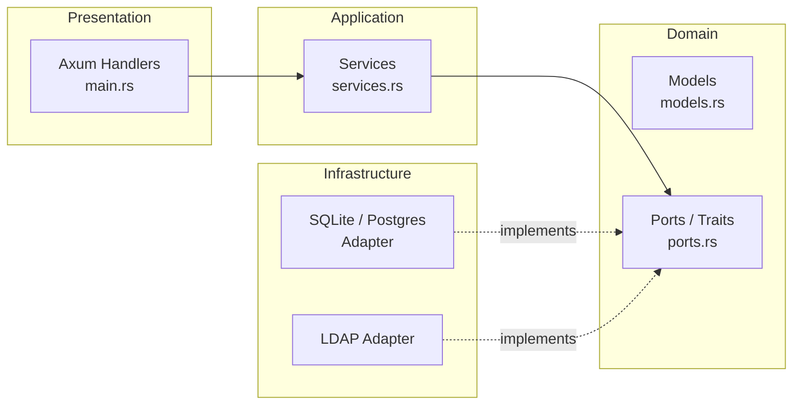
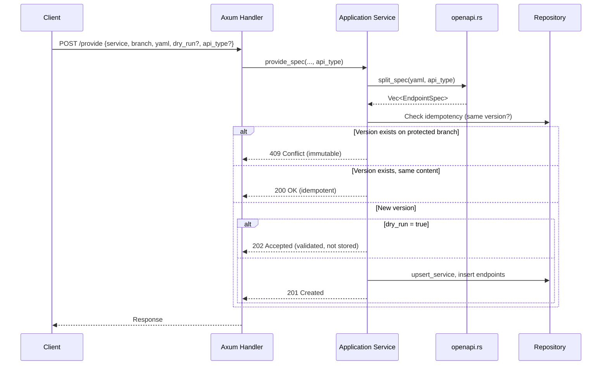
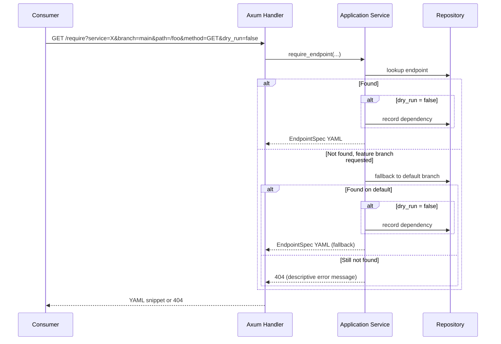
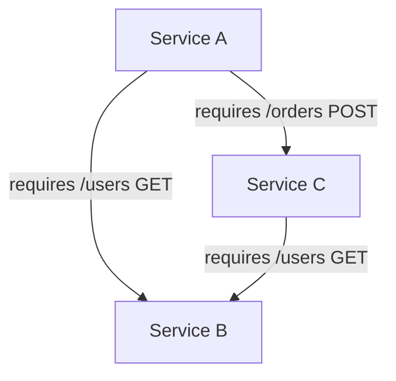
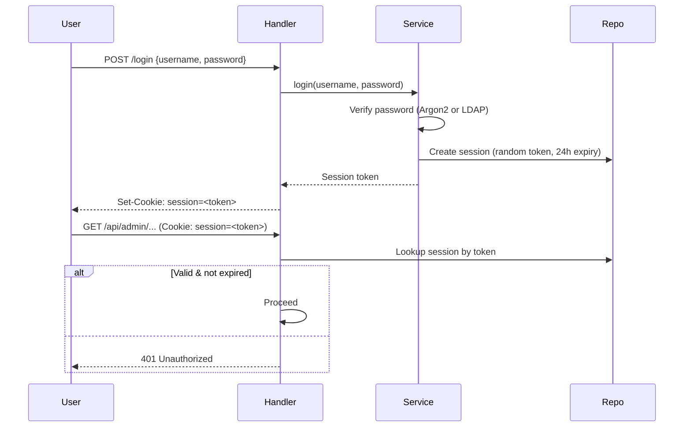
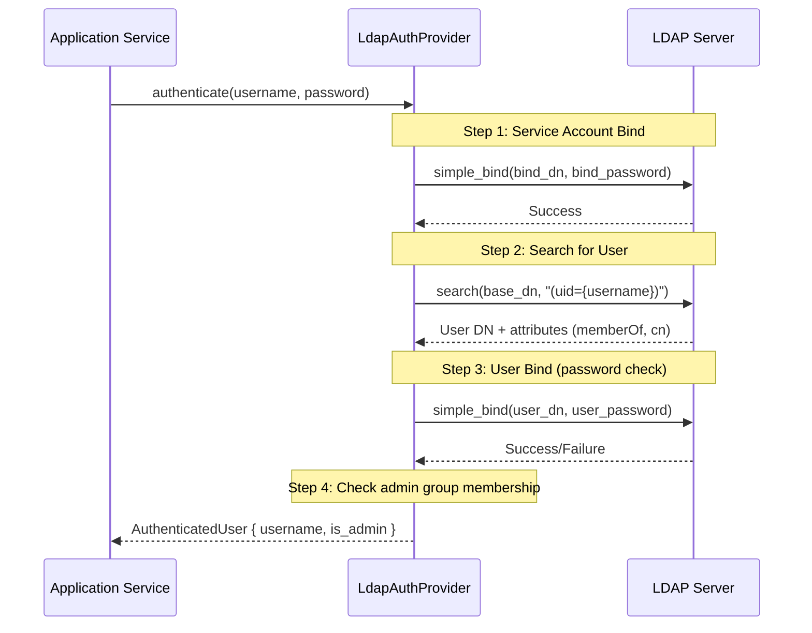
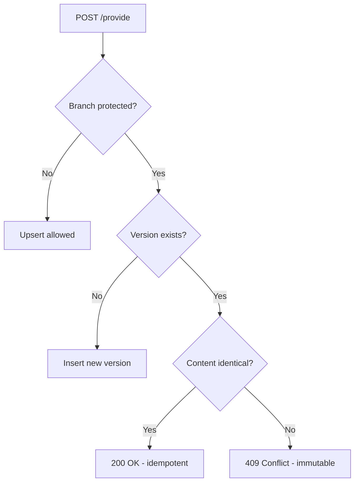

# Developer Guide — Sanshain Service Internals

This document is for developers performing security audits, contributing code, or evaluating the service architecture. It provides a transparent, in-depth look at every major subsystem.

---

## Architecture Overview

Sanshain follows **DDD Hexagonal (Onion) Architecture** with four layers:



**Dependency rule**: arrows point inward. Domain has zero external dependencies. Infrastructure implements domain port traits. Application orchestrates domain logic. Presentation is a thin HTTP shell.

### Directory Layout

```
src/
├── main.rs                  # Axum server, routes, thin handlers
├── domain/
│   ├── models.rs            # Value objects, entities, enums
│   └── ports.rs             # Repository & AuthProvider traits
├── application/
│   └── services.rs          # Use-case functions (business logic)
├── infrastructure/
│   ├── mod.rs               # Module declarations
│   ├── sqlite_repository.rs # SQLite adapter (implements Repository)
│   ├── postgres_repository.rs # PostgreSQL adapter
│   └── ldap_provider.rs     # LDAP adapter (implements AuthProvider)
└── openapi.rs               # OpenAPI spec parsing & splitting
```

---

## Feature: Contract Provide & Require

### Purpose

Services **provide** their OpenAPI, AsyncAPI, or Proto specs to Sanshain. Consumers **require** specific endpoints, channels, or methods. This creates a live dependency graph and enables contract compatibility checks across protocols.

### Provide Flow (`POST /provide`, `/provide/asyncapi`, `/provide/grpc`)



**Key behaviors:**
- **Idempotency**: Re-providing the same version with identical content is a no-op (200).
- **Immutability on protected branches**: Once a version is published on a protected branch (e.g., `main`), it cannot be overwritten. Returns 409 with a descriptive error message (method, path, branch, service name).
- **Feature-branch override**: Non-protected branches allow version overwrites (useful for CI iteration).
- **Dry run**: When `dry_run: true`, all validation runs (parsing, splitting, conflict detection) but nothing is persisted. Returns 202 on success.

### Spec Splitting (`openapi.rs`, `asyncapi.rs`, `proto.rs`)

The `split_spec` function (dispatched by `api_type`) takes a full specification and produces one `EndpointSpec` per operation:

```rust
pub struct EndpointSpec {
    pub path: String,         // e.g., "/users/{id}" (OpenAPI), "topic" (AsyncAPI), "Service" (Proto)
    pub method: String,       // e.g., "GET" (OpenAPI), "PUB" (AsyncAPI), "Method" (Proto)
    pub api_type: ApiType,    // OpenAPI, AsyncApi, Proto
    pub yaml_content: String, // Standalone YAML/Proto with this operation + only referenced components
}
```

**How it works:**
1. Parse YAML into an `openapiv3::OpenAPI` struct.
2. Iterate over `paths` → for each path, iterate over methods (GET, POST, PUT, DELETE, PATCH).
3. For each operation, construct a minimal OpenAPI document containing only that path/method.
4. Extract only the referenced `components` (schemas, responses, parameters, etc.) by scanning `$ref` strings and transitively resolving nested references.
5. Serialize back to YAML.

This ensures each snippet is self-contained and includes only the schemas/components actually used by that specific operation.

### Require Flow (`GET /require`)



**Long-polling**: If the endpoint isn't available yet, the request blocks (with a configurable timeout) until the spec is provided by another service. This enables CI pipelines where provider and consumer jobs run concurrently.

**Feature-branch fallback**: If a consumer requests a feature branch that doesn't exist, Sanshain falls back to the default branch. This means consumers on `main` always get `main` specs, while feature branches get their own overrides if available.

**Dependency tracking**: Every `require` call (unless `dry_run=true`) is recorded, building a dependency graph (Service A → Service B endpoint). This powers the report and graph features.

**Descriptive errors**: When an endpoint is not found, the 404 response body includes the service name, branch, and endpoint details. For `/require-bundle`, all missing endpoints are listed.

---

## Feature: Dependency Reports

### `GET /report` and `GET /report/markdown`

The report aggregates all recorded `require` relationships into a dependency matrix:

- **JSON report**: Machine-readable list of services, their provided endpoints, and which clients consume them.
- **Markdown report**: Human-readable table rendered by the web UI.

### Dependency Graph (Mermaid)

The web UI renders a live dependency graph using Mermaid.js. The graph data is generated server-side:



**Cycle detection**: The application layer runs a DFS-based cycle detection on the dependency graph. Cycles are flagged in the report and highlighted in the UI.

---

## Feature: Authentication & Authorization

### Auth Modes

The system supports three authentication modes, stored as a setting in the database:

| Mode    | Behavior                                                                                       |
|---------|------------------------------------------------------------------------------------------------|
| `Dev`   | No authentication required. All requests are allowed. For development only.                     |
| `Local` | Built-in user management. Argon2id password hashing. Admin approval required for new users.     |
| `Ldap`  | Delegates authentication to an external LDAP/AD server. Shadow accounts created locally.          |

### Session-Based Auth



### Password Hashing (Local Mode)

Passwords are hashed with **Argon2id** (via the `argon2` crate) using:
- Random 16-byte salt per password
- Default Argon2id parameters (19 MiB memory, 2 iterations, 1 parallelism)
- PHC string format storage (e.g., `$argon2id$v=19$m=19456,t=2,p=1$...`)

Verification uses constant-time comparison. No plaintext passwords are ever stored or logged.

### API Tokens

For CI/CD integration, users can create API tokens:

1. A random token is generated with the `san_` prefix (e.g., `san_a1b2c3d4...`).
2. The token is **SHA-256 hashed** before storage — the plaintext is shown once and never stored.
3. On API requests, the `Authorization: Bearer san_...` header is SHA-256 hashed and looked up in the database.
4. Tokens are scoped to the user and can be revoked individually.

### LDAP Authentication (Bind-and-Search)

When auth mode is `Ldap`, the login flow delegates to `LdapAuthProvider`:



**Shadow accounts**: On first LDAP login, a local `User` row is created with `password_hash = "!ldap-managed!"` — a sentinel value that can never match Argon2 verification. This allows the rest of the system (sessions, tokens, permissions) to work identically regardless of auth backend.

**TLS**: The `ldap3` crate uses **rustls** (pure Rust, no OpenSSL dependency):
```toml
ldap3 = { version = "0.11", default-features = false, features = ["tls-rustls"] }
```
This means `ldaps://` URLs work with zero system dependencies.

### CSRF Protection

All state-changing HTML form submissions include a CSRF token:
- Token is generated server-side and embedded in a hidden form field.
- On submission, the token is validated before processing.
- API endpoints using `Authorization` headers are exempt (token-based auth is inherently CSRF-safe).

---

## Feature: Admin API & Protected Branches

### Protected Branches

Admins can designate branches as "protected" (e.g., `main`, `release/*`). Protected branches enforce **immutability**: once a version is published, it cannot be overwritten. This prevents accidental or malicious contract changes in production.



### Admin Endpoints

All admin endpoints require an authenticated session with `is_admin = true`:

| Endpoint                                | Purpose                      |
|-----------------------------------------|------------------------------|
| `GET/POST /api/admin/protected-branches` | Manage protected branches    |
| `DELETE /api/admin/services/:name`       | Delete service (cascade)     |
| `GET/POST /api/admin/users`             | List/approve users           |
| `GET/PUT /api/admin/auth-config`         | Auth mode & LDAP config      |
| `POST /api/admin/auth-config/test`      | Test LDAP connectivity       |
| `PUT /api/admin/settings`                | Dev-mode, local-users toggles |

---

## Feature: Database Layer

### Dual Database Support

The `Repository` port trait is implemented by two adapters:

| Adapter             | File                    | Use Case                               |
|---------------------|-------------------------|----------------------------------------|
| `SqliteRepository`   | `sqlite_repository.rs`   | Default, zero-config, single-file DB   |
| `PostgresRepository` | `postgres_repository.rs` | Production, multi-instance deployments |

Selection is via the `DATABASE_URL` environment variable:
- `sqlite://...` or absent → SQLite
- `postgres://...` → PostgreSQL

### Migrations

Both adapters use `sqlx` with auto-applied migrations at startup:

```
src/infrastructure/migrations/
├── sqlite/
│   └── 20240308000000_initial_schema.sql
└── postgres/
    └── 20240308000000_initial_schema.sql
```

The schema includes tables for: `services`, `branches`, `endpoints`, `clients`, `dependencies`, `users`, `sessions`, `api_tokens`, `settings`, `protected_branches`.

### Repository Port Trait

```rust
#[async_trait]
pub trait Repository: Send + Sync {
    async fn upsert_service(&self, name: &str) -> Result<i64>;
    async fn upsert_branch(&self, service_id: i64, name: &str) -> Result<i64>;
    async fn insert_endpoint(&self, ...) -> Result<()>;
    async fn get_endpoint(&self, ...) -> Result<Option<EndpointRecord>>;
    async fn record_dependency(&self, ...) -> Result<()>;
    async fn get_setting(&self, key: &str) -> Result<Option<String>>;
    async fn set_setting(&self, key: &str, value: &str) -> Result<()>;
    // ... ~25 methods total
}
```

All database access goes through this trait. The application layer never touches SQL directly.

---

## Feature: Security Headers

Every response includes hardened HTTP headers:

| Header                    | Value                                                                                    | Purpose                           |
|---------------------------|------------------------------------------------------------------------------------------|-----------------------------------|
| `Content-Security-Policy` | `default-src 'self'; script-src 'self' 'unsafe-inline'; style-src 'self' 'unsafe-inline'` | Prevents XSS via injected scripts |
| `X-Content-Type-Options`  | `nosniff`                                                                                | Prevents MIME-type sniffing       |
| `X-Frame-Options`         | `DENY`                                                                                   | Prevents clickjacking             |

These are applied as middleware in the Axum router.

---

## Feature: Observability

### Structured Logging

The service uses `tracing` + `tower-http::TraceLayer`:
- Every HTTP request is logged with method, path, status, and duration.
- Warn/error level for failures (4xx/5xx).
- Configurable via `RUST_LOG` environment variable (e.g., `RUST_LOG=sanshain_service=debug`).

### Health Endpoint

`GET /health` returns `200 OK` with no authentication required. Used by load balancers and container orchestrators.

---

## Testing Strategy

### Unit Tests

Located alongside the code they test (Rust convention):

| Module        | Tests | What's Covered                                                                                |
|---------------|-------|-----------------------------------------------------------------------------------------------|
| `openapi.rs`  | 5     | Splitting single/multiple endpoints, invalid YAML, components inclusion, empty paths          |
| `services.rs` | ~20   | Provide/require logic, auth mode dispatch, LDAP config validation, token hashing, markdown rendering |
| `models.rs`   | ~5    | LdapConfig validation, AuthMode serialization                                                 |

Domain and application tests use a **mock repository** implementing the `Repository` trait in-memory. LDAP tests use a mock `AuthProvider`.

### Integration Tests

Located in `tests/integration_test.rs`. These spin up a real Axum server with an in-memory SQLite database:

| Test                                                      | What's Covered                                   |
|-----------------------------------------------------------|--------------------------------------------------|
| `test_provide_and_require`                                | Full provide → require → verify YAML round-trip  |
| `test_feature_branch_fallback`                            | Require from feature branch falls back to default |
| `test_protected_branch_immutability`                      | Cannot overwrite version on protected branch     |
| `test_report_endpoints`                                   | JSON and markdown report generation              |
| `test_auth_config_api`                                    | Auth mode and LDAP config CRUD                   |
| `test_require_does_not_create_phantom_service`            | Phantom service prevention                       |
| `test_delete_service_does_not_create_phantom_client`      | Phantom client prevention                        |
| `test_require_missing_endpoint_returns_descriptive_error` | Descriptive 404 error messages                   |
| `test_provide_conflict_returns_descriptive_error`         | Descriptive 409 error messages                   |
| `test_provide_dry_run_does_not_store_data`                | Dry-run provide validation                       |
| `test_require_dry_run_does_not_create_dependency`         | Dry-run require validation                       |
| ... | 26 tests total |

### Running Tests

```bash
cargo test              # All tests
cargo test --lib        # Unit tests only
cargo test --test '*'   # Integration tests only
```

---

## Build & Deployment

### Docker

Multi-stage Dockerfile:
1. **Builder stage**: Rust toolchain, compiles release binary.
2. **Runtime stage**: Minimal base image, copies only the binary + static assets.

```bash
docker build -t sanshain-service .
docker run -p 3000:3000 -v data:/data sanshain-service
```

### CI/CD (GitHub Actions)

- **CI workflow**: Runs `cargo test`, `cargo clippy`, `cargo fmt --check` on every PR.
- **Release workflow**: Builds Docker image, pushes to GHCR on tag.

---

## Dependency Choices

| Crate        | Purpose          | Why This One                                         |
|--------------|------------------|------------------------------------------------------|
| `axum`       | HTTP framework   | Tokio-native, tower middleware, ergonomic extractors |
| `sqlx`       | Database         | Compile-time query checking, async, multi-DB         |
| `argon2`     | Password hashing | OWASP recommended, pure Rust                         |
| `ldap3`      | LDAP client      | Only maintained async LDAP crate for Rust            |
| `openapiv3`  | OpenAPI parsing  | Type-safe OpenAPI 3.x model                          |
| `askama`     | Templating       | Compile-time templates, XSS-safe by default          |
| `tower-http` | Middleware       | CORS, tracing, compression — composable              |
| `rustls`     | TLS (for LDAP)   | Pure Rust, no OpenSSL system dependency              |
