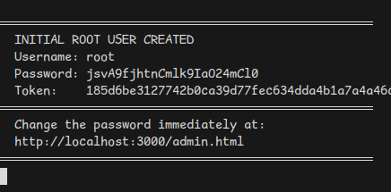

# Getting Started

This guide walks you through installing Sanshain Service, logging in for the first time, and configuring the essential settings.

## Installation with Docker

The quickest way to get Sanshain running is to pull the pre-built image from the GitHub Container Registry:

```bash
docker pull ghcr.io/paxel/sanshain-service:latest
docker run -p 3000:3000 -v ~/sanshain-db-dir/:/data ghcr.io/paxel/sanshain-service:latest
```

This creates a fresh SQLite database with secure defaults and generates a **root** account with a random password.

> **Tip:** The database is persisted in the mounted volume (`~/sanshain-db-dir/`), so your data survives container restarts.

## First Login

On first start, Sanshain prints the initial root credentials to the console output:



Copy the password, then open the URL shown in the log message to access the admin dashboard. Log in with username **root** and the generated password.


After a successful login, you will see the admin dashboard:

## Change the Root Password

Immediately change the root password to something memorable — or store the generated one in a password manager.


## Initial Configuration

By default, Sanshain is **completely locked down**: all API endpoints require authentication, and user self-registration is disabled. Before the service is usable you need to adjust at least one of the following settings from the admin dashboard:

| Setting | What it does |
|---|---|
| **Developer Mode** | Opens all non-admin REST endpoints (`/provide`, `/require`, `/report`) without authentication. Useful for local development and quick testing. |
| **Local User Registration** | Allows users to create accounts via the web UI. New accounts still require admin approval before they can log in. |

You can also manage **protected branch patterns** from the admin dashboard. By default, `main` and `master` are protected, meaning endpoint definitions on those branches are immutable — any change to an existing endpoint path requires a version bump (e.g., `/api/v1/users` → `/api/v2/users`).

## Next Steps

- **Populate sample data** — Run the [demo script](../demo.sh) to register example services and clients so you can explore the UI right away. See the [Demo Script](../README.md#demo-script) section in the README for details.
- **Provide your first spec** — Use `POST /provide` to upload an OpenAPI YAML for one of your services. See the [API Usage](../README.md#api-usage) section.
- **Create an API token** — Visit `/account.html` to generate a `san_`-prefixed token for CI pipelines.
- **Explore the dependency graph** — Open `/service.html` to browse services, branches, endpoints, and client dependencies.
