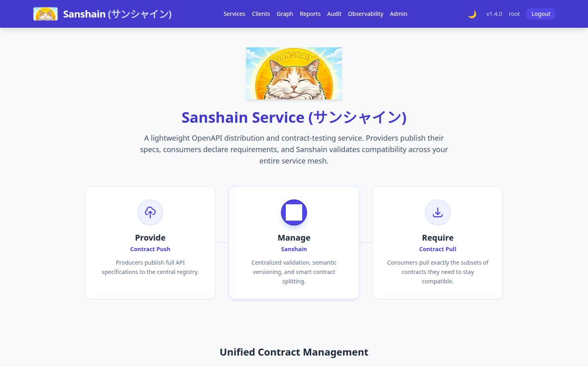
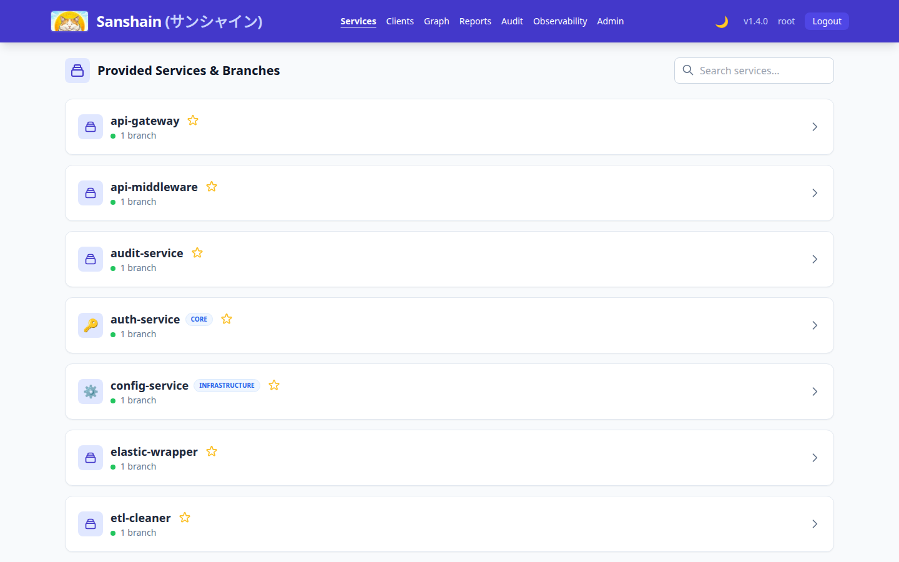
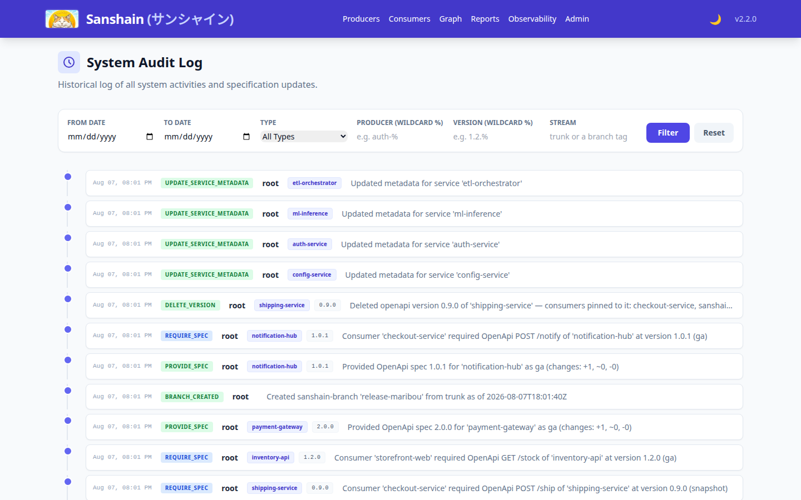
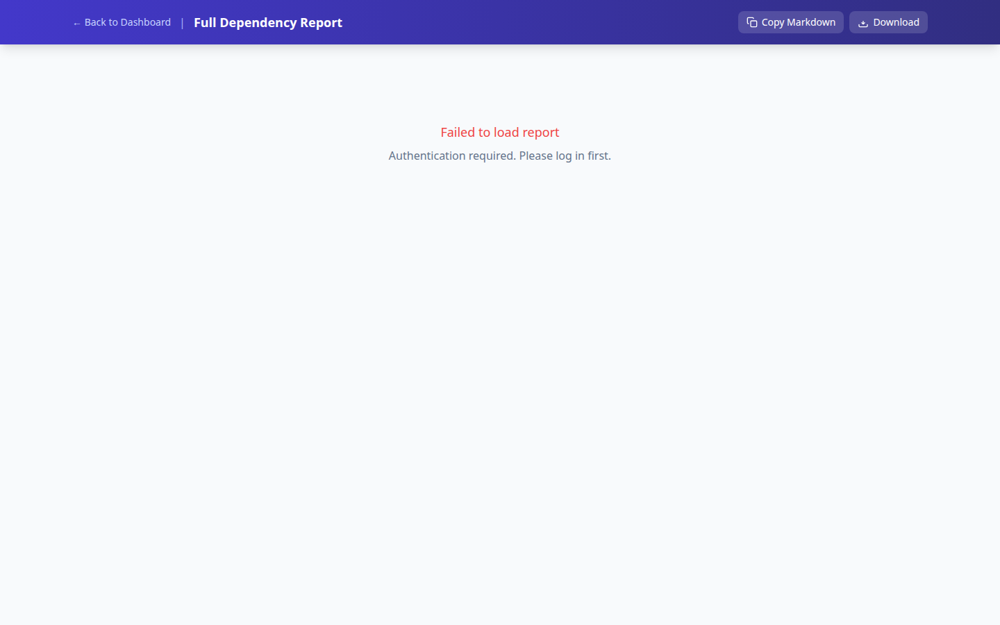

# User Guide

This guide covers the day-to-day workflows for developers using Sanshain Service: publishing API specifications, consuming endpoints, and browsing the dependency graph.

> **Prerequisites:** A running Sanshain instance and either Dev Mode enabled or a valid API token. See [Getting Started](getting-started.md) for installation and [Administration](administration.md) for configuration.

## Concepts

| Term                        | Meaning                                                                                                                                           |
|-----------------------------|---------------------------------------------------------------------------------------------------------------------------------------------------|
| **Provide**                 | Upload a full OpenAPI YAML, AsyncAPI YAML, or Proto file for a service on a given branch. Sanshain splits it into per-endpoint (or channel/method) snippets automatically. |
| **Require**                 | Request the snippet for a single endpoint, channel, or method and record the caller as a dependent client.                                        |
| **Report**                  | Generate a dependency report showing used, unused, and missing requirements for a branch across all protocols.                                    |
| **Protected branch**        | A branch (e.g. `main`) where only backward-compatible schema changes are allowed. Breaking changes are rejected.                                   |
| **Feature branch fallback** | If an endpoint is not found on a feature branch, Sanshain falls back to a protected branch or a configured service fallback branch.               |
| **Dry run**                 | A validation-only mode (`dry_run: true`) that checks contracts without persisting data. Designed for PR validation in CI.                          |

## Build Tool Integration

Sanshain is designed to be used through **build tool plugins** that integrate directly into your development workflow. You should never need to call the REST API manually — the plugins handle authentication, spec upload, snippet retrieval, and code generation for you.

Dedicated plugins and tools are being developed for common build systems and languages, including:

- **Maven** (Java / Kotlin)
- **Gradle** (Java / Kotlin)
- **npm** (JavaScript / TypeScript)
- **Cargo** (Rust)
- **Go modules**

> **Note:** Links to the individual tool repositories will be added here as they become available. Check back soon or watch the [Sanshain GitHub organisation](https://github.com/paxel) for new releases.

The client-facing API is formally specified in [`api.yaml`](../api.yaml) as an OpenAPI 3.0.3 document. Plugin authors can use this contract with [OpenAPI Generator](https://openapi-generator.tech/) to produce client SDKs in any supported language.

## What Happens Under the Hood

When you use a Sanshain plugin, the following happens automatically:

### Providing a spec

1. The plugin reads your OpenAPI, AsyncAPI, or Proto file and uploads it to Sanshain for the current service and branch.
2. Sanshain parses the file and splits it into one snippet per endpoint (path + method for OpenAPI), channel (for AsyncAPI), or service method (for Proto).
3. On a **protected branch**, Sanshain performs a **backward compatibility check** (currently for OpenAPI). Backward-compatible changes are accepted and a new service-level version is recorded. Breaking changes are rejected with `409 Conflict`.
4. On a **feature branch**, existing definitions can be updated, but **multi-publisher conflict detection** ensures that shared endpoints remain compatible with the original source or current owner on that branch.
5. **Optimistic Concurrency**: If a `base_version` is provided, Sanshain ensures the update is applied only if it matches the current server version, preventing accidental overwrites in concurrent development.
6. **Content-Based Skipping**: If the uploaded specification's SHA-256 hash matches the current version, the server skips the update and returns the existing version, reducing unnecessary version bumps.
7. If `dry_run` is set to `true`, all validation runs but nothing is stored — useful for CI checks.

### Requiring an endpoint

1. The plugin requests the snippet for a specific endpoint, channel, or method and records your service as a dependent client.
2. Sanshain returns the minimal document containing only the requested item and its referenced schemas/messages.
3. The plugin feeds this snippet into a code generator to produce typed client code in your language.
4. If the item is not found, the response includes a descriptive error message listing the service, branch, and protocol details.
5. If `dry_run` is set to `true`, the lookup runs but no dependency is recorded.

### Long-polling

During parallel builds the provider may not have published yet. Plugins can use a timeout parameter to wait — Sanshain will poll internally and return the snippet as soon as it appears.

### Feature branch fallback

If the endpoint is not found on a feature branch, Sanshain automatically falls back to a protected branch (e.g. `main`). This means clients on a feature branch still get a valid contract even if the provider hasn't published to that branch yet.

## Browsing the Web UI

#### Landing Page (`/`)

The landing page shows the service version and links to all sections.

#### Services (`/services.html`)

Lists all registered services and their branches. Click a service to drill into its branches and endpoints.

Each branch view shows the total number of endpoints, how many are used by at least one client, and how many are unused. Click an endpoint to see which clients depend on it.

The YAML viewer includes **Copy** and **Download** buttons for easy export of endpoint specifications.

#### Dependency Graph (`/graph.html`)

The **Graph** section visualizes the dependency relationships between services and clients on the selected branch. Version 1.4.0 introduces a custom high-performance SVG renderer with interactive tooltips and sub-graph highlighting.

- **Green** nodes are clients only.
- **Purple** nodes are services only.
- **Orange** nodes act as both client and service.
- **Red** edges indicate circular dependencies.

Click a node or edge to see detailed metadata and direct links to the involved specifications.

Toggle **Mermaid** or **Detailed view** to switch between different visualization styles.

#### Audit Timeline (`/audit.html`)

New in 1.4.0, the **Audit** page provides a global chronological log of all specification updates across the system. This allows administrators to track who changed what and when.

Every entry includes a **View Changes** button that opens a side-by-side diff viewer, making it easy to see exactly what was modified in a specification update.

### Stale Data Detection

When the server is restarted or updated, a yellow banner appears at the top of the page offering a one-click reload. This ensures you always see the latest data without manually clearing the browser cache.

### Dark / Light Mode

All pages include a 🌙/☀️ toggle in the navigation bar to switch between dark and light themes. Your preference is saved in a cookie and persists across sessions and pages.

### Dependency Report

The dependency report for a branch lists:

- **Dependencies** — which clients use which endpoints.
- **Unused endpoints** — provided but not required by any client.
- **Missing requirements** — required by a client but not provided by any service.

### System Reports

The **Reports** section provides system-wide compliance and isolation reports, organized by branch.

- **Service Isolation Report**: Lists all outbound network connections per service in markdown tables with Target, Protocol, and Port columns. AsyncAPI connections are shown as routing through the central message service (KAFKA).
- **Markdown Report**: A full text-based report of dependencies and unused endpoints.

## Typical Workflow

1. **Service team** adds or updates their OpenAPI spec. The build tool plugin publishes it to Sanshain automatically during CI (or locally).
2. **Client team** runs their build. The plugin fetches the required endpoint snippets and generates typed client code.
3. **Both teams** check the Service Overview page to see endpoint usage and identify unused or missing endpoints.
4. **Before a release**, review the dependency report for the target branch to verify there are no missing requirements.

## Next Steps

- [CI Integration](ci-integration.md) — Setting up API tokens and dry-run validation for CI pipelines.
- [Administration](administration.md) — Managing users, protected branches, and settings.
- [Getting Started](getting-started.md) — Installation and first-time setup.
