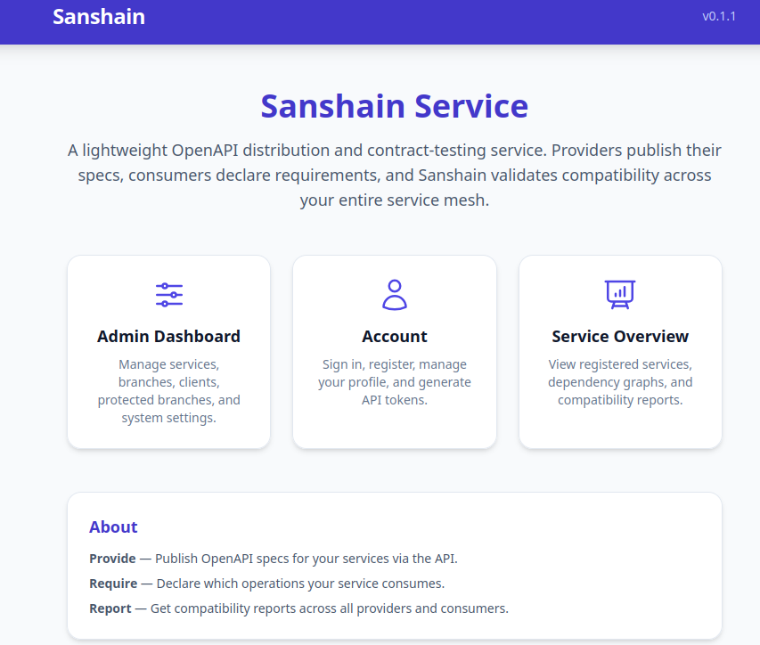
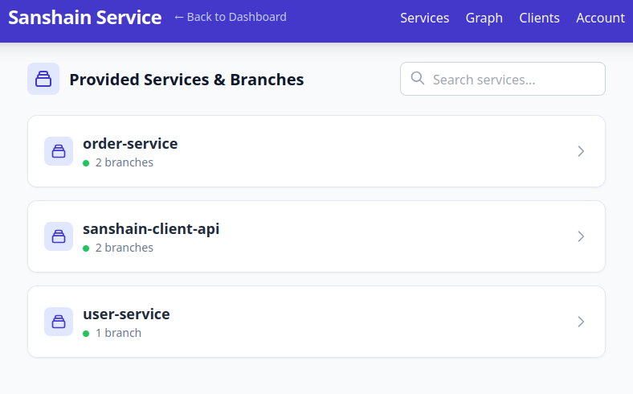
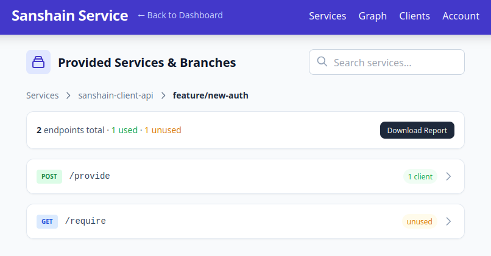
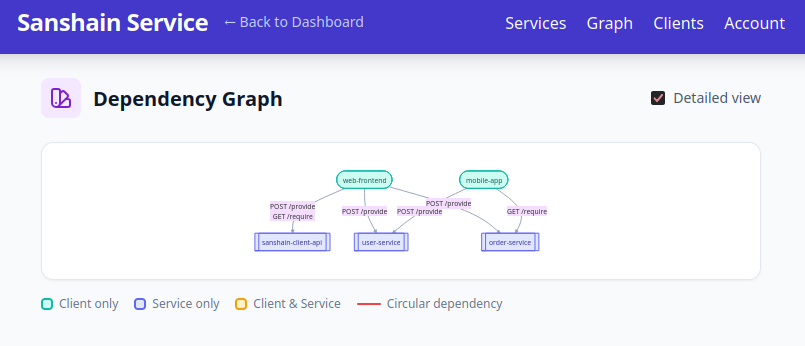

# User Guide

This guide covers the day-to-day workflows for developers using Sanshain Service: publishing API specifications, consuming endpoints, and browsing the dependency graph.

> **Prerequisites:** A running Sanshain instance and either Dev Mode enabled or a valid API token. See [Getting Started](getting-started.md) for installation and [Administration](administration.md) for configuration.

## Concepts

| Term                        | Meaning                                                                                                                  |
|-----------------------------|--------------------------------------------------------------------------------------------------------------------------|
| **Provide**                 | Upload a full OpenAPI YAML for a service on a given branch. Sanshain splits it into per-endpoint snippets automatically. |
| **Require**                 | Request the OpenAPI snippet for a single endpoint and record the caller as a dependent client.                           |
| **Report**                  | Generate a dependency report showing used, unused, and missing endpoints for a branch.                                   |
| **Protected branch**        | A branch (e.g. `main`) where endpoint schemas are immutable — changes require a path version bump.                       |
| **Feature branch fallback** | If an endpoint is not found on a feature branch, Sanshain falls back to a protected branch.                              |
| **Dry run**                 | A validation-only mode (`dry_run: true`) that checks contracts without persisting data. Designed for PR validation in CI. |

## Build Tool Integration

Sanshain is designed to be used through **build tool plugins** that integrate directly into your development workflow. You should never need to call the REST API manually — the plugins handle authentication, spec upload, snippet retrieval, and code generation for you.

Dedicated plugins and tools are being developed for common build systems and languages, including:

- **Maven** (Java / Kotlin)
- **Gradle** (Java / Kotlin)
- **npm** (JavaScript / TypeScript)
- **Cargo** (Rust)
- **Go modules**

> **Note:** Links to the individual tool repositories will be added here as they become available. Check back soon or watch the [Sanshain GitHub organisation](https://github.com/paxel) for new releases.

The client-facing API is formally specified in [`api.yaml`](../api.yaml) as an OpenAPI 3.0.3 document. Plugin authors can use this contract with [OpenAPI Generator](https://openapi-generator.tech/) to produce client SDKs in any supported language.

## What Happens Under the Hood

When you use a Sanshain plugin, the following happens automatically:

### Providing a spec

1. The plugin reads your OpenAPI YAML file and uploads it to Sanshain for the current service and branch.
2. Sanshain parses the YAML and splits it into one snippet per endpoint (path + method).
3. On a **protected branch**, if an endpoint path already exists with a different schema, the request is rejected with a descriptive error message (including the method, path, branch, and service name). Bump the path version (e.g. `/api/v1/users` → `/api/v2/users`) and retry.
4. On a **feature branch**, existing endpoint schemas are freely overwritten.
5. If `dry_run` is set to `true`, all validation runs but nothing is stored — useful for CI checks.

### Requiring an endpoint

1. The plugin requests the OpenAPI snippet for a specific endpoint and records your service as a dependent client.
2. Sanshain returns the minimal OpenAPI document containing only the requested endpoint and its referenced schemas.
3. The plugin feeds this snippet into a code generator to produce typed client code in your language.
4. If the endpoint is not found, the response includes a descriptive error message listing the service, branch, and endpoint details.
5. If `dry_run` is set to `true`, the lookup runs but no dependency is recorded.

### Long-polling

During parallel builds the provider may not have published yet. Plugins can use a timeout parameter to wait — Sanshain will poll internally and return the snippet as soon as it appears.

### Feature branch fallback

If the endpoint is not found on a feature branch, Sanshain automatically falls back to a protected branch (e.g. `main`). This means clients on a feature branch still get a valid contract even if the provider hasn't published to that branch yet.

## Browsing the Web UI

### Landing Page (`/`)

The landing page shows the service version and links to all sections.

### Service Overview (`/service.html`)

Lists all registered services and their branches. Click a service to drill into its branches and endpoints.

Each branch view shows the total number of endpoints, how many are used by at least one client, and how many are unused. Click an endpoint to see which clients depend on it.

The YAML viewer includes **Copy** and **Download** buttons for easy export of endpoint specifications.

### Dependency Graph

The **Graph** tab visualises the dependency relationships between services and clients on the selected branch.

- **Green** nodes are clients only.
- **Purple** nodes are services only.
- **Orange** nodes act as both client and service.
- **Red** edges indicate circular dependencies.

Toggle **Detailed view** to show individual endpoint paths on the edges.

Use the **Copy** button to copy the generated Mermaid code to the clipboard, or **Download** to save it as a `.mmd` file.

### Dependency Report

The dependency report for a branch lists:

- **Dependencies** — which clients use which endpoints.
- **Unused endpoints** — provided but not required by any client.
- **Missing requirements** — required by a client but not provided by any service.

See [reports/demo.md](reports/demo.md) for an example report.

## Typical Workflow

1. **Service team** adds or updates their OpenAPI spec. The build tool plugin publishes it to Sanshain automatically during CI (or locally).
2. **Client team** runs their build. The plugin fetches the required endpoint snippets and generates typed client code.
3. **Both teams** check the Service Overview page to see endpoint usage and identify unused or missing endpoints.
4. **Before a release**, review the dependency report for the target branch to verify there are no missing requirements.

## Next Steps

- [CI Integration](ci-integration.md) — Setting up API tokens and dry-run validation for CI pipelines.
- [Administration](administration.md) — Managing users, protected branches, and settings.
- [Getting Started](getting-started.md) — Installation and first-time setup.
