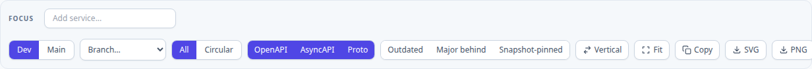
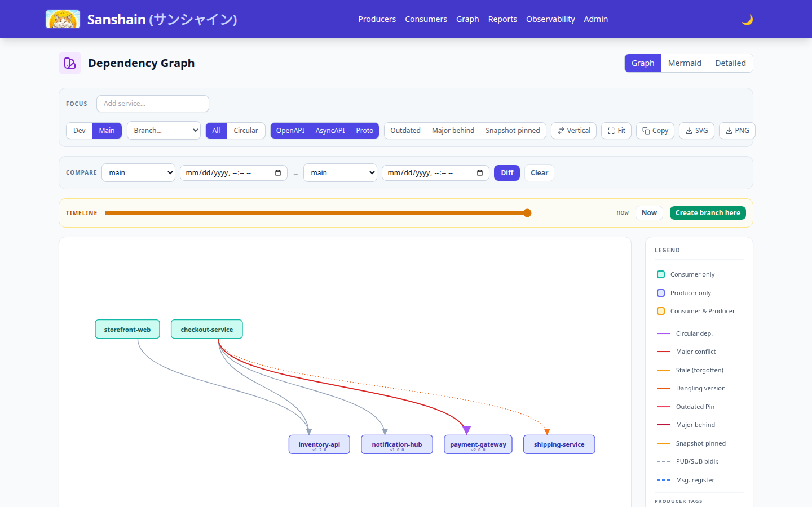
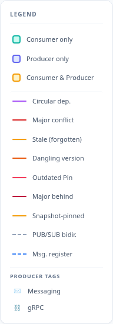
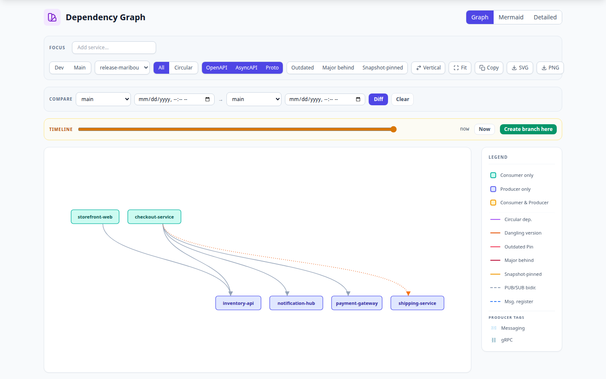
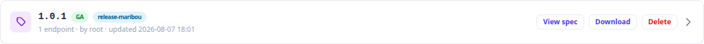
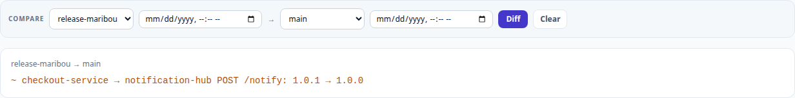
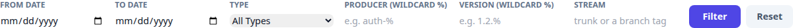

# User Guide

This guide covers day-to-day workflows for developers using Sanshain Service.

### TL;DR
- **Publish**: Producers upload their API specs (OpenAPI, AsyncAPI, Proto) to Sanshain, versioned and with a declared stability.
- **Consume**: Consumers pin an exact version and download only the specific endpoint snippets they need.
- **Streams**: Mark trunk builds with `trunk: true` and release builds with `tag: <branch>` — Sanshain maintains a **main graph** (what trunk is) and **sanshain-branches** (what each release is) next to the accumulated dev activity.
- **Verify**: Use **Dry Run** mode in PRs to validate specs and preview version classification before they merge.
- **Explore**: Use the Web UI to navigate the dependency graph (dev, main, or a release), travel its timeline, diff two graphs, and read the audit trail.

---

## Core Concepts
- **Provide**: Upload a spec. Sanshain reads the version from the spec itself (`info.version`, or `// sanshain-version:` for proto) and splits it into per-endpoint snippets. Version strings accept an optional leading `v` and omitted MINOR/PATCH (`v2` → `2.0.0`).
- **Stability**: Declared on every Provide. `snapshot` = overwritable work-in-progress that expires when unused; `ga` = immutable, the number is permanently claimed.
- **Require**: Request a snippet for a single endpoint at a pinned version and record the dependency.
- **Pin**: A Consumer's exact version choice, written in its own configuration. No ranges, no `latest`.
- **Stream**: Where a build belongs. Plain calls record dev activity; `trunk` marks the trunk stream (the main graph); `tag: <branch>` marks a release branch. Streams never change version rules or what is served — they only decide which graph records the call.
- **Sanshain-branch**: A named copy of a graph at a chosen instant — the release cut. Created by a releaser, hotfixable via tags, diffable against main or other branches.
- **Dry Run**: Validation-only mode for CI pipelines (`dry_run: true`). Writes nothing, not even the service.

## Build Tool Integration
Integrate Sanshain directly into your build process using dedicated plugins. They handle authentication, spec upload, and code generation.

- [**Maven Plugin**](https://github.com/paxel/sanshain-maven-plugin) (Java / Kotlin)
- [**Rust (Cargo)**](https://github.com/paxel/sanshain) (Rust)
- [**Go CLI**](https://github.com/paxel/sanshain-go) (Go)
- [**JavaScript/TypeScript**](https://github.com/paxel/sanshain-js) (Node.js / CI)
- [**Conan Plugin**](https://github.com/paxel/sanshain-conan) (C / C++)

The API is formally specified in [`api.yaml`](../api.yaml).

---

## How it Works

### Providing a Spec
1. Plugin uploads your spec to `/provide` (or `/provide/asyncapi`, `/provide/grpc`), declaring `snapshot` or `ga` stability (`snapshot` unless the build sets the ga switch — see [sanshain.yaml](sanshain-yaml.md#how-stability-is-decided)). Publishing GA requires the `releaser` role.
2. Sanshain reads the version from the spec and splits the file into standalone snippets per operation.
3. **Version Rules**: a GA number is immutable — re-providing it with different content returns `409 Conflict` with a `proposed_version` to publish as instead. A GA whose changes against the previous GA are breaking without a major bump is also rejected with the correct proposal.
4. **Idempotency**: Byte-identical specs are a no-op — CI re-runs never fight.
5. **Snapshots**: Overwritable, last writer wins; the previous provider is named in the audit trail.

### Multi-Producer Topics (AsyncAPI)

Kafka topic names are a **global namespace**, so a topic (audit log, DLQ, …) can have many
producers. Sanshain tracks AsyncAPI compatibility per **message**: on GA provides, every *named*
`publish` message registers a contract keyed by `(channel, message name)`, owned by the first
Producer to publish it. The owner may widen its own message; a second producer of the same
channel + message name is accepted only if its payload is identical, otherwise rejected with
`409` naming the owner. Snapshots are never contract-checked. **Name your messages**
(`name`/`title`) — unnamed messages have no cross-service identity and are skipped. See
[API Lifecycle §6](api-lifecycle.md#6-multi-producer-topics-asyncapi-message-contracts) for the
full rules.

### Requiring an Endpoint
1. Plugin calls `/require` for a specific path + method at the pinned version.
2. Sanshain serves exactly the pinned version — no fallback, no ranges. An unknown pinned version answers `404`; a version that exists but no longer contains the endpoint answers `410`. The `X-Sanshain-Stability` response header names the stability actually served.
3. Sanshain returns a minimal YAML/Proto containing only that operation and its models, and records the dependency edge.
4. Plugin generates client code from the returned snippet. Multi-endpoint fetches use `/require-bundle`.

### Declaring the Stream
Both provide and require accept an optional stream marker:

- `trunk: true` (provide) / `trunk=true` (require) — this build is your trunk CI. Provides stamp the version as *trunk's current version* (shown as a badge on the producers page); requires maintain the **main graph**'s pin set. Re-running an unchanged trunk build is exactly what keeps trunk fresh.
- `tag: "<branch>"` — this build belongs to the named sanshain-branch (a release pipeline or hotfix). The call updates that branch's graph instead of trunk. `trunk` and `tag` together answer `400`; an unknown tag answers an instructive `404` — branches are never auto-created.

Trunk data ages: pins and markers not refreshed within the configurable trunk TTL (default 90 days) leave the main graph (they stay as history), and the graph highlights entries as stale once they pass half the TTL — forgotten producers surface before they vanish.

---

## The Dependency Graph (`/graph.html`)

The graph page renders every service relationship as an interactive SVG, with
three views selected in the toolbar:



- **Dev** (default): the accumulated recorded activity — everything ever provided/required, snapshots included.
- **Main**: the trunk stream — producers at their trunk version, edges are the current trunk pins.
- **Branch…**: a sanshain-branch's pin set — what a release actually is.

All views share the focus filter (type a service name to spotlight its neighborhood), the Circular mode, the protocol filters (OpenAPI/AsyncAPI/Proto), and the **Outdated** / **Snapshot-pinned** highlight toggles.

### The Main View



The main view surfaces problems the dev view cannot see:



- **Red edge** — the pin lags the producer's trunk version by a major: trunk moved on, this consumer didn't.
- **Amber dashed edge (⚠ stale)** — the pin wasn't refreshed since half the trunk TTL: a forgotten build, about to age out.
- **Orange dotted edge (dangling)** — the pinned version was deleted. Never silently dropped; it heals automatically when the number is re-provided.
- **Snapshot-pinned** — the pin is served from an overwritable snapshot.

### Sanshain-Branches (Release Cuts)

A releaser creates a branch as a copy of the main graph (or another branch) at a chosen instant — including a **past** instant, so a forgotten release cut can be repaired retroactively:

```bash
curl -X POST $SANSHAIN/admin/branches \
  -H "Authorization: Bearer $TOKEN" -H "Content-Type: application/json" \
  -d '{"name": "release-maribou"}'            # optional: "source", "as_of"
```

Pick the branch in the graph toolbar to render it:



Hotfixes flow in through tagged provides/requires (`tag: "release-maribou"`). Branches can be renamed (membership and timeline survive) and deleted (freeing the name) from the admin dashboard. `main`, `dev` and `trunk` are reserved: the first two name the built-in graph views, and `trunk` is the stream a trunk-flagged build records, so a branch of that name would be indistinguishable from trunk CI in the audit filter. Producer version rows show chips naming every branch that references the version, plus the trunk badge:



### The Timeline

The main and branch views carry a timeline slider whose markers are the instants the graph actually changed. Drag it to render the graph as it was at that date — and releasers can "create branch here", the retroactive release cut:


### Comparing Graphs

The Compare panel diffs any two graph selections — release vs release, release vs main, either side optionally at a past instant. The result is structured: services added/removed, pins added/removed/changed:



Graph exports (SVG/PNG/mermaid) are stamped with their view, branch and instant, so a screenshot of a release graph never masquerades as current truth.

---

## Reports (`/reports.html`)

Architecture, isolation and dependency reports take a **graph scope**: `dev` (default), `main`, or a sanshain-branch — the latter two optionally at an instant (`main@2026-08-01T00:00:00Z`). A release-scoped report describes what production actually is, and carries a `Scope:` line:


---

## Web Dashboard Features

#### Producers (`/producers.html`)
- Browse registered producers and their version lines (version, stability, snapshot expiry, trunk badge, branch chips).
- View endpoint usage and availability; "View spec" opens the full stored document with version history, diff and blame.
- Copy or download endpoint specifications.

#### Consumers (`/consumers.html`)
- Browse consumers and the exact pins they hold.

#### Audit Timeline (`/audit.html`)
- **Administrators only.** The page and the data behind it are restricted, and
  the Audit link is hidden from the navigation for everyone else.
- Global log of all spec updates and administrative actions, with a side-by-side diff viewer for every change.
- Filters by date range, action type, service/version wildcards — and by **stream**, so "who changed release-maribou, when?" is one query. A branch is tracked by identity, not by its label, so renaming it keeps its history findable under the new name:



---

## Next Steps
- [**CI Integration**](ci-integration.md) — Setting up automation.
- [**Corporate Best Practices**](corporate-best-practices.md) — Recommendations for enterprise usage.
- [**Administration**](administration.md) — Managing users, settings, and branches.
- [**Troubleshooting**](troubleshooting.md) — Solving common issues.
